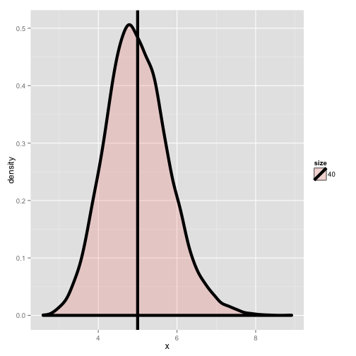
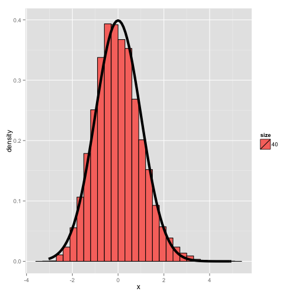

Exponential distribution simulation
========================================================
author: Igor Kaplanovic
date: 2015-02-22

Reasons
========================================================

Exponential distribution simulation is a small educational
Shiny application.

It is intended as a small tool for showing how exponentaial
distribution works in courses such as Statistical inference.

Methodology of simulation
========================================================

All data used in simulator are generated according to the parameters selected by the student.
There are 3 parameters:
- lambda,
- number of simulations to perform and
- number of observations per each simulation.

Matrix of all values is calculated only once and then used for displaying two plots.


```r
mat <- matrix(rexp(nosim * noobs, lambda), nosim)
```

Plot of distribution of generated values with expected mean value
========================================================

 

Plot showing that the distribution is approximately normal.
========================================================

 

